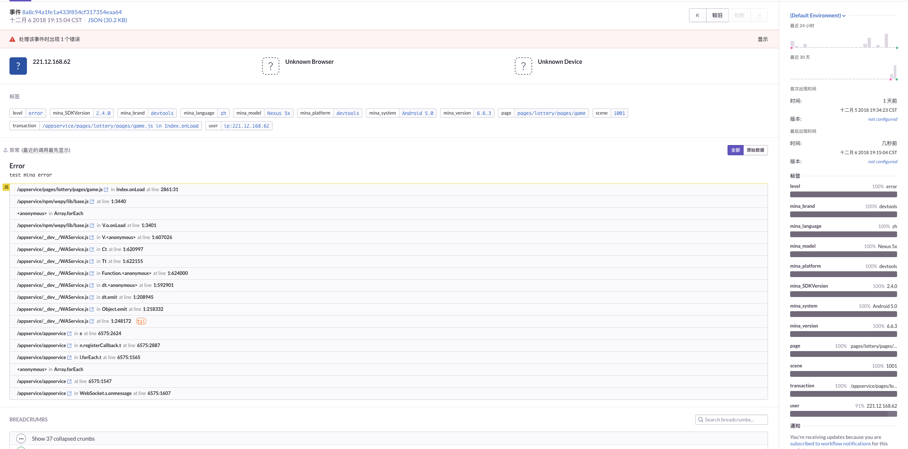
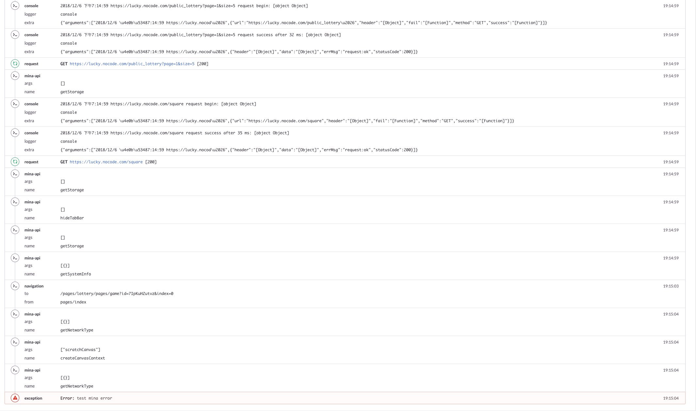
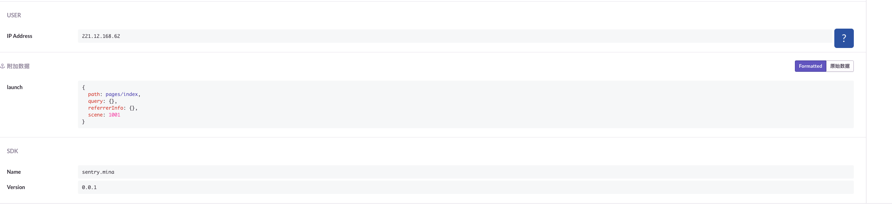

# 小程序 Sentry SDK (Beta)

## 特性

除了 Sentry 基础的特性，还提供以下小程序相关特性

- 记录客户端基本信息
- 记录页面 request 请求
- 记录应用生命周期（onAppLaunch, onAppShow, onAppHide）
- 记录页面导航
- 记录小程序 api 调用
- 记录 console 日志
- 记录应用框架异常和未捕获异常
- 记录微信小程序 Unhandled Promise Rejection Error
- 记录 setTimeout, setInterval 内异常
- 支持小程序 [LogManager](https://developers.weixin.qq.com/miniprogram/dev/api/base/debug/wx.getLogManager.html)
- 支持小程序实时日志 [getRealtimeLogManager](https://developers.weixin.qq.com/miniprogram/dev/framework/realtimelog/)

## 相关链接

- [Trello](https://trello.com/b/1rlFQOAo/sentry-mina)
- [Sentry 快速入门](https://docs.sentry.io/quickstart/)
- [Sentry 官方 API 文档](http://getsentry.github.io/sentry-javascript/)

## 使用

### 安装

- `npm i sentry-mina --save`

### 小程序环境

默认环境为微信小程序，其他平台小程序可在初始化时配置特定平台环境对象

``` javascript
sentry.init({
  minaContext: wx
})

sentry.init({
  minaContext: {
    getSystemInfo: () => {},
    request: () => {},
    setStorage: () => {},
    getStorageSync: () => {},
    getLaunchOptionsSync: () => {},
    // ...
  }
})
```

### 微信开发工具配置

控制台报 `regeneratorRuntime is not defined` 错误，在开发工具上启用 `增强编译` 可解决 [@NullYing](https://github.com/alexayan/sentry-mina/issues/2)

### 微信后台配置

开发中配置 sentry.io 的 url 地址。（sentry.io 未经过 icp 备案，需自己做转发）

### Usage

```javascript
import * as sentry from "sentry-mina";

// config Sentry
sentry.init({
  dsn: ''
})

// Set user information, as well as tags and further extras
Sentry.configureScope(scope => {
  scope.setUser({ id: '4711' });
  scope.setTag('user_mode', 'admin');
  scope.setExtra('battery', 0.7);
  // scope.clear();
});

// Add a breadcrumb for future events
Sentry.addBreadcrumb({
  message: 'My Breadcrumb',
  // ...
});

// Capture exceptions, messages or manual events
Sentry.captureMessage('Hello, world!');
Sentry.captureException(new Error('Good bye'));
Sentry.captureEvent({
  message: 'Manual',
  stacktrace: [
    // ...
  ],
});

```

### INTEGRATIONS

#### Breadcrumbs

``` javascript
new sentry.Integrations.Breadcrumbs({
  console: true,
  realtimeLog: ['info', 'warn', 'error'], // https://developers.weixin.qq.com/miniprogram/dev/framework/realtimelog/
  request: true,
  navigation: true,
  api: true,
  lifecycle: true,
  unhandleError: true
})
```

配置 | 类型 | 默认值 |描述
------------- | ------------- | ------------- | -------------
console  | Boolean, Array | true |是否记录 console 日志，如果值为数组 ['log', 'info']，则只记录数组中所列的日志
realtimeLog | Boolean, Array | true |是否记录实时日志，如果值为数组 ['log', 'info']，则只记录数组中所列的日志。将程序中通过 console 打的日志记录到小程序实时日志中, console.log 通过 realtimeLog.info 进行记录
request  | Boolean | true | 是否记录页面 request 请求
navigation  | Boolean | true | 是否记录页面导航信息
api  | Boolean | true | 是否记录小程序 API 调用
lifecycle  | Boolean | true | 是否记录小程序生命周期变化
unhandleError | Boolean | true | 是否记录微信小程序 Unhandled Promise Rejection Error

#### TryCatch

捕获并记录 setTimeout, setInterval 内的异常

```javascript
new sentry.Integrations.TryCatch()
```

#### LogManager

将 Sentry 事件数据记录到小程序 LogManager

```javascript
new sentry.Integrations.LogManager({
  level: 0
})
```

配置 | 类型 | 默认值 |描述
------------- | ------------- | ------------- | -------------
level  | Number | 0 | 取值为0表示是否会把 App、Page 的生命周期函数和 wx 命名空间下的函数调用写入日志，取值为1则不会

#### GlobalHandlers

记录 app.onError 和 app.onPageNotFound 日志

```javascript
new sentry.Integrations.GlobalHandlers()
```

### TRANSPORT

目前小程序只支持通过 request 发送日志到服务器，由于小程序 request 有并发限制, `sentry-mina` 以队列的方式发送日志请求，避免过多占用请求资源。

`sentry-mina` 发送日志，支持失败重试，默认重试 2 次。可以通过以下方式

```javascript
sentry.init({
  transportOptions: {
    retry: 2
  }
})
```

进行配置。

`sentry-mina` 会记录未发送的日志，当用户重新进入小程序，会继续发送。

## PREVIEW




